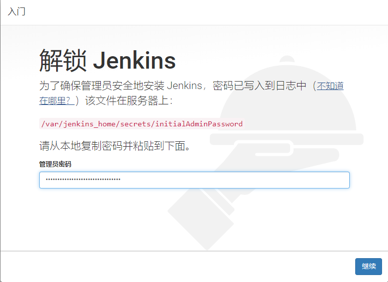
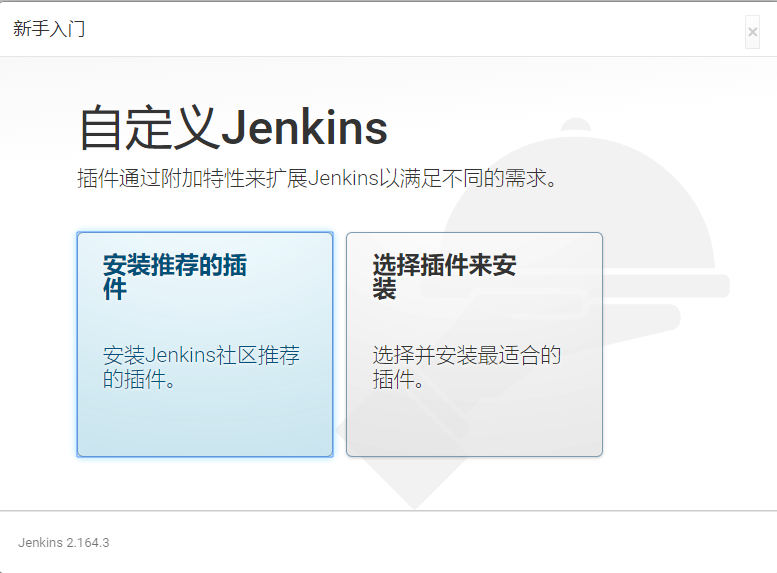
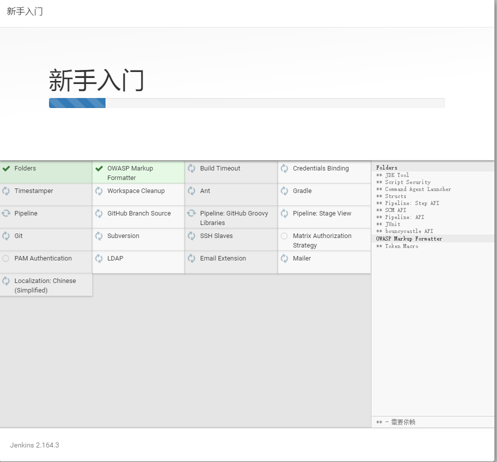
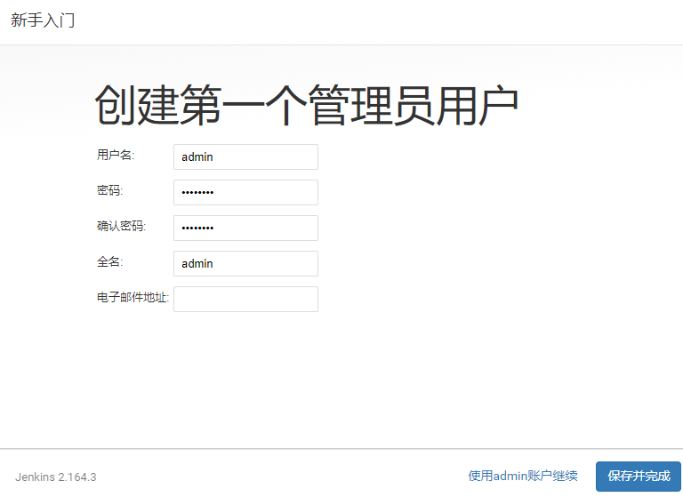
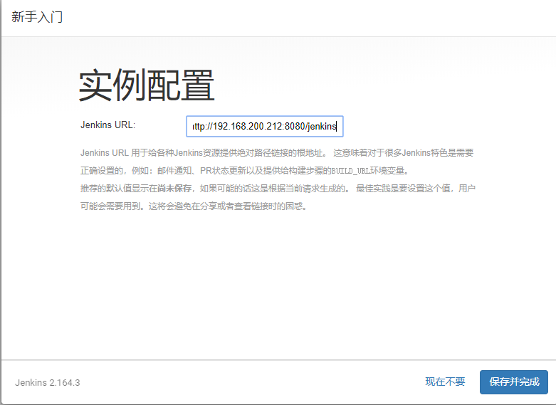

# docker 安装 Jenkins

### 执行安装指令

```bash
docker run --name jenkins  -p 8080:8080 -p 50000:50000 -v jenkins_home:/var/jenkins/jenkins_home jenkins/jenkins:lts
```

* --name: 容器名称
* -p:     向外暴露端口号，8000:80 将镜像默认80端口，向外暴露为8000
* -v      目录路径映射，jenkins_home映射到宿主主机的/var/jenkins/jenkins_home目录下


执行：

```bash
[root@server-test-212 jenkins]# docker run --name jenkins  -p 8080:8080 -p 50000:50000 -v jenkins_home:/var/jenkins/jenkins_home jenkins/jenkins:lts
Unable to find image 'jenkins/jenkins:lts' locally
lts: Pulling from jenkins/jenkins
c5e155d5a1d1: Pull complete 
221d80d00ae9: Pull complete 
4250b3117dca: Pull complete 
3b7ca19181b2: Pull complete 
1eadaf4c0dff: Pull complete 
4c1388ac89fe: Pull complete
```

执行结束：

```bash
May 30, 2019 4:05:35 AM jenkins.install.SetupWizard init
INFO: 

*************************************************************
*************************************************************
*************************************************************

Jenkins initial setup is required. An admin user has been created and a password generated.
Please use the following password to proceed to installation:

fa2378bef32e40adbeca823f63a7235a

This may also be found at: /var/jenkins_home/secrets/initialAdminPassword

*************************************************************
*************************************************************

```

### 安装成功







### 参考

[https://github.com/jenkinsci/docker](https://github.com/jenkinsci/docker)

[quick-tutorial-of-jenkins](https://medium.com/@gustavo.guss/quick-tutorial-of-jenkins-b99d5f5889f2)

[jenkins docker](https://juejin.im/post/5b6af759e51d451951138eb4)
